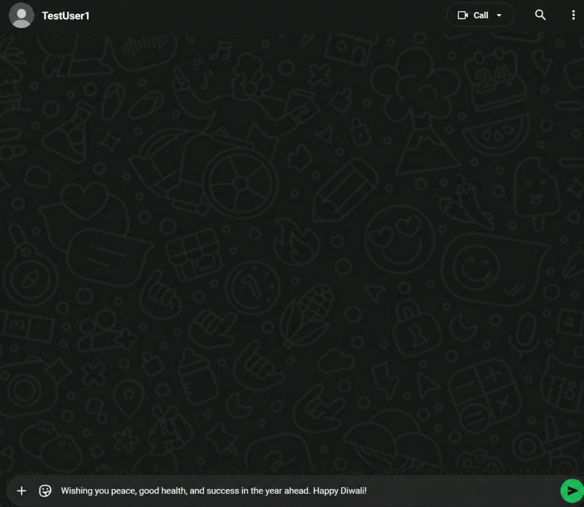
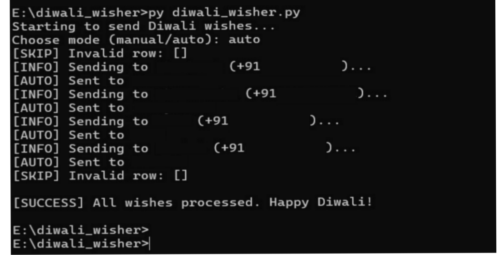
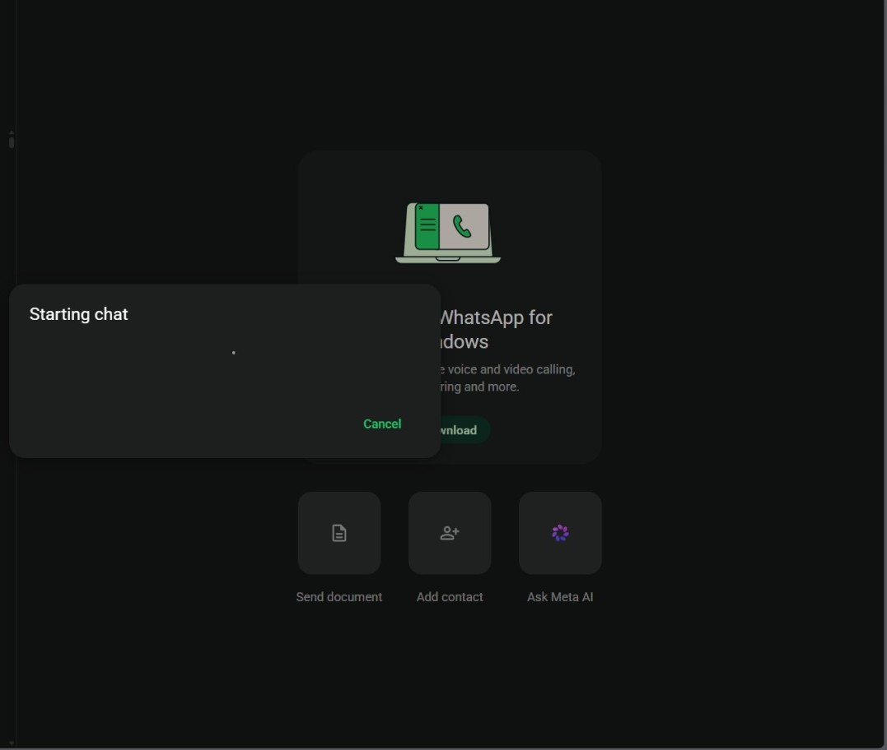

# Festive Wish Automation (Python)
> ⚠️ This project is for educational purposes. Use responsibly and avoid spamming.

## 📸 Demo

### 🔹 WhatsApp Message Preview

### 🔹 Script Execution (Terminal)

### 🔹 WhatsApp Interface

Automates bulk WhatsApp messaging by eliminating repetitive manual effort using Python and browser automation.
---

## 🚀 Features
- Reads contacts from a CSV file
- Sends randomized messages from a predefined list
- Supports **Auto Mode** and **Manual Mode**
- Automates WhatsApp Web interaction

---

## ⚙️ How It Works

1. Reads contact data from a CSV file  
2. Randomly selects a message from a predefined list  
3. Opens WhatsApp Web via browser automation  
4. Injects the message into the chat input  
5. Sends automatically (Auto Mode) or waits for user confirmation (Manual Mode)

---

## 🛠 Tech Stack

- Python  
- PyWhatKit (WhatsApp automation)  
- PyAutoGUI (keyboard automation)  
- CSV (data handling)

## 🧠 Modes

### 🔹 Auto Mode
- Fully automated
- Sends messages and proceeds automatically

### 🔹 Manual Mode
- Opens chat and pastes the message  
- Waits for user confirmation before sending  

---

## 📂 Project Structure
diwali_wisher.py # Main automation script
messages.py # Predefined message list
sample_contacts.csv # Dummy contact data
requirements.txt # Dependencies

---

## 📦 Setup

Install dependencies:
  pip install -r requirements.txt

Run the script:
  python diwali_wisher.py

---

## ⚠️ Limitations

- Depends on WhatsApp Web loading speed  
- Requires active internet connection  
- Timing-based automation may vary across systems

  

## ⚠️ Important Notes
- Requires WhatsApp Web login
- Keep browser open during execution
- Sample CSV contains **dummy data only**
- Replace with real data in a private environment

---

## 🔮 Future Improvements
- Faster execution
- Selenium-based automation
- Multi-category messaging (birthdays, festivals, etc.)

---
## 💡 Why I Built This

During Diwali, I noticed people around me struggling to send and reply to a large number of messages manually.

At the same time, I was learning Python and exploring automation. So I built this project to solve a real problem I observed — automating repetitive festive messaging.

This project helped me learn:
- File handling with CSV
- Automation using Python
- Handling manual vs automated workflows

## 🧑‍💻 Author
Advait Pathak
